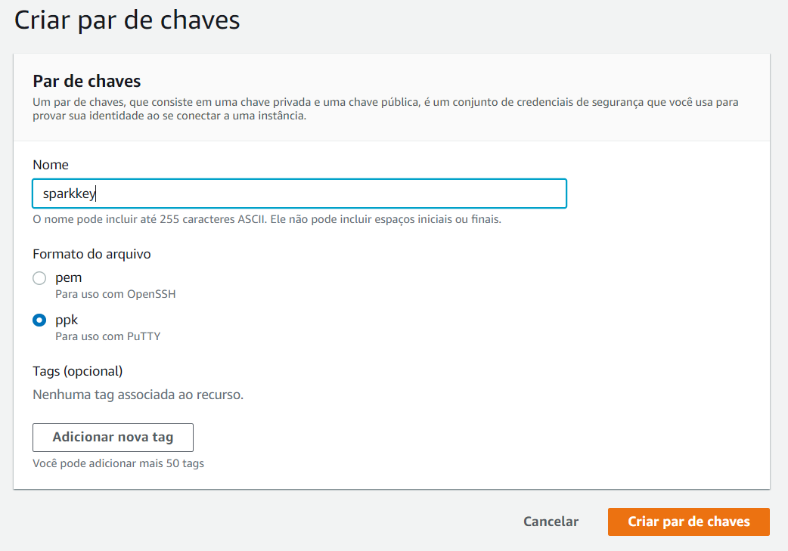
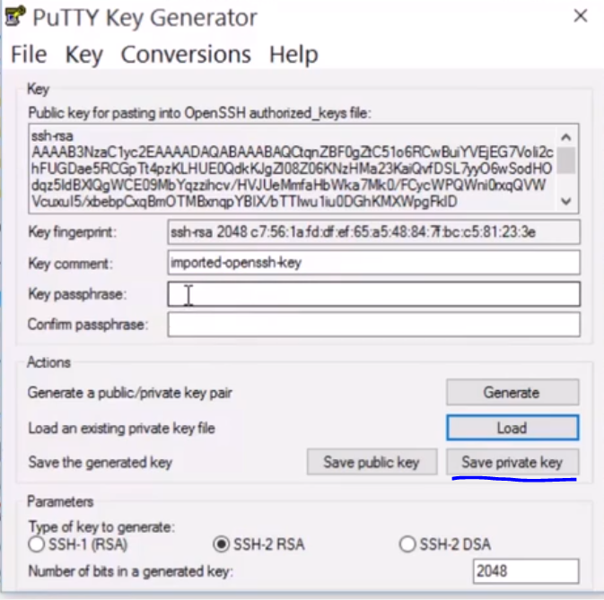
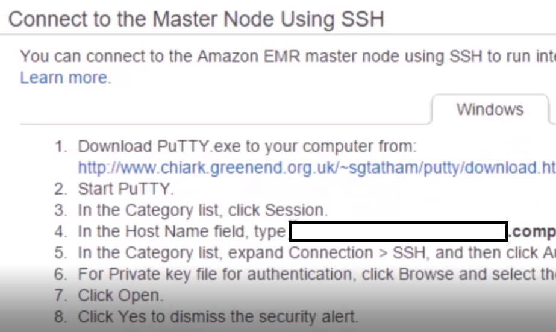

### AWS Amazon Elastic MapReduce  
  
* Pode ser configurada para Spark. 
* Usa uma parte de Hadoop e é caro, pois usa m3.xlarge ~ 0.266$ por hora por instance. 10 instances = 10 x 0.266$ por hora.  
* Possível gasto de 30$ somente em algumas horas.
-------------
Dessa maneira, vou apenas documentar cada passo do processo.  
-------------
### Primeiros passos  
  
1. Criar conta na AWS.  
2. Uso do EMR "Elastic MapReduce" Framework.  
3. Necessário Private e Public Key para conectar nas EMR instances.  
4. Clicar em EC2 "Elastic Computing Cloud"  
5. Clicar em Pares de Chaves "Key Pairs"
6. Clicar em Criar par de Chaves  
7. Inserir o nome da chave "e.g. sparkkey"

  
  
8. Download as chaves e manter em local seguro.   
9. Instalar PuTTy  putty.exe puttygen.exe para converter pen file to ppk file que putty pode usar.  
10. Abrir putty e clicar em load (alterar para all files)  e selecionar sparkkey.pem.  
11. OK, save private key

  
  
12. Abir putty, ir em SSH -> Auth -> Browse ppk file .
13. EM putty ir em Session, no Hostname colocar o hostname do cluster.  
--------------
### Partitioning  
  
1. SparkConf() não tem argumentos no codigo, mas pela CLI passamos os argumentos dos clusters.  
2. Dados carregados da S3 distribuited file system da Amazon.  1 milhao ratings dataset.    
3. Split ::  
---------------  
### Running on Spark Cluster on AWS  
  
* spark-submit -executor-memory 1g MovieSimilarities1M.py 260     
* 1giga de memoria por execucao. EMR set Yarn como Deafault.  
  -----------

1. Na AWS, Clicar em EMR.
2. Clicar em Create Cluster, entrar o nome do cluster.  
3. Setar a aplicação primária para Spark.  
4. Number of Instances 10, cuidado! lol  
5. Key par: sparkkey criado anteriormente.  
6. Clicar em Create Cluster.  
-----------------------------
7. Em master public DNS clicar em SSh  
  
  
8. copy host name field, abrir puuty e colocar no host name, ir em SSH > Auth, selecionar ppk file.
9. Voce esta logado.
10. Com o codigo para ser executado np S3 digitar no putty: aws s3 cp s3://sundog-spark/MovieSimilarities1M.py ./  
11. aws s3 cp s3://sundog-spark/ml-1m/movies.dat ./  
12. spark-submit --executor-memory 1g MovieSimilarities1M.py 260.
13. o "260" e o id do filme que busco a similaridade.  
-------------
SHUT DOWN YOUR CLUSTER!  
  
